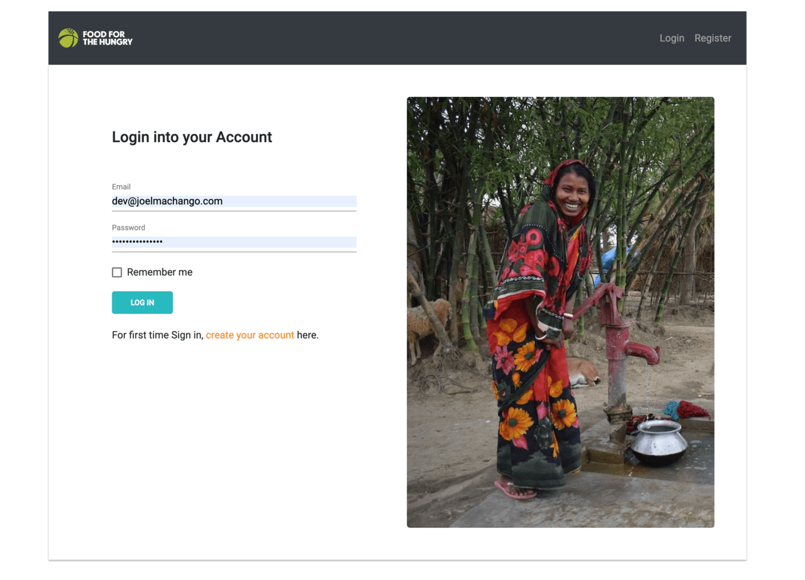

### _Landing page_




# fh Grants Management Application

Like many other international non-governmental organizations (INGO), Food for the Hungry (FH) receives grants from various sources to aid it in it's core mission of ending hunger worldwide. These grants are normally utilized in various projects as indicated here https://www.fh.org/grant-projects/

This system is used for managing grant related data from **Inception** through to **Termination**.

## Database Entity Relationship Diagram(ERD) 
<div style="width: 640px; height: 480px; margin: 10px; position: relative;"><iframe allowfullscreen frameborder="0" style="width:640px; height:480px" src="https://lucid.app/documents/embeddedchart/a70acd59-77bf-45c4-8c8b-f0612ae7a9e6" id="OQxLc9RowxLZ"></iframe></div>


## Usage

- Authentication

- Greate a Grant

- View a Grant's Details

- Update a Grant

- Delete a Grant

## Installation

_Download the project to your local computer through_

- Download a zip folder of this repository

### Alternatively

_Run the following command_

```
$ git clone git@github.com:joelmachango/fh-code-challenge.git
```

## Technologies & Languages

**Angular 8.2.14**

**Laravel 5.5.**

**MySQL**

**Angular Material**

**Version control (Git)** [https://git-scm.com/](https://git-scm.com/)

**HTML5**

**SCSS**

**JavaScript**

**TypeScript**

**PHP**

## Authors

[Joel Machango](https://joelmachango.com/)

## License

MIT

## Acknowledgement

[fh.org](https://www.fh.org/) - Code Challenge
